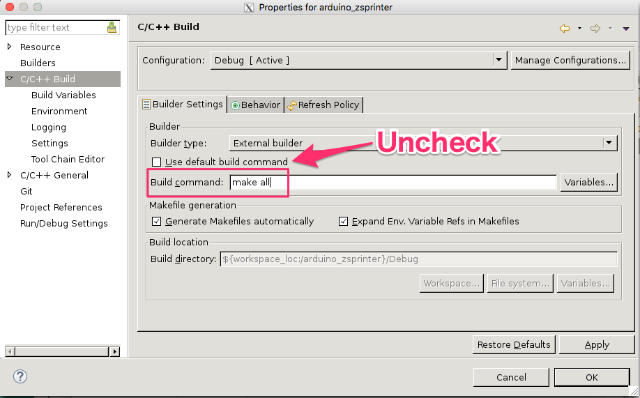
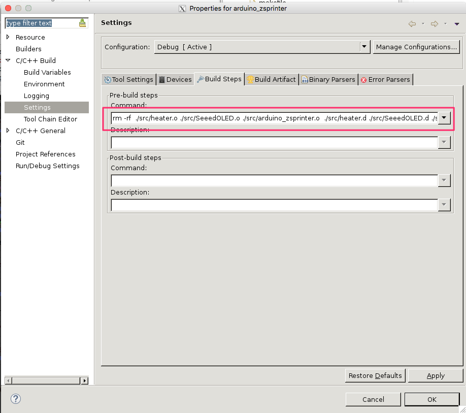

# Zsprinter-pynquino

## What is this
A 3D printer firmware which runs on PYNQ-Z1. Codes are derived from the Sprinter by kliment. https://github.com/kliment/sprinter

## How to build with CLI (under the PYNQ/pynq/lib/arduino folder)
1. Prepare Pynquino BSP using the instruction here.
https://github.com/shohei/pynquino-bsp-library

2. Clone this repository
```
cd pynq/pynq/lib/arduino
git clone https://github.com/shohei/zsprinter-pynquino
mv zsprinter-pynquino/arduino_zsprinter .
cp -r ../../../boards/sw_repo/bsp_iop_arduino_mb bsp_iop_arduino
(If your hardware design is the same as mine, do the following: 
mv zsprinter-pynquino/bsp_iop_arduino .)
cd arduino_zsprinter/Debug
make
```

##  How to build with GUI (Xilinx SDK)
1. Clone this library to SDK folder
```
cd pynq/pynq/boards/Pynq-Z1/base/base/base.sdk
git clone https://github.com/shohei/zsprinter-pynquino
mv zsprinter-pynquino/arduino_zsprinter .
mv zsprinter-pynquino/bsp_iop_arduino .
```
2. Import BSP and Zsprinter project into Xilinx SDK

3. Change C/C++ build setting

Not sure why, but Xilinx SDK executes "make clean" all the time, rather than "make all".
We have to force "make all" as shown in the picture below.



Attention: because of the make behavior above, "make clean" doesn't do anything. For cleaning purpose, use "make mrproper" instead.
You can put clean script manually using pre-build step in the C/++ build setting.
Use following command as the pre-build command.
```
rm -rf  ./src/heater.o ./src/SeeedOLED.o ./src/arduino_zsprinter.o  ./src/heater.d ./src/SeeedOLED.d ./src/arduino_zsprinter.d  arduino_zsprinter.elf.size  arduino_zsprinter.elf arduino_zsprinter.bin
```


